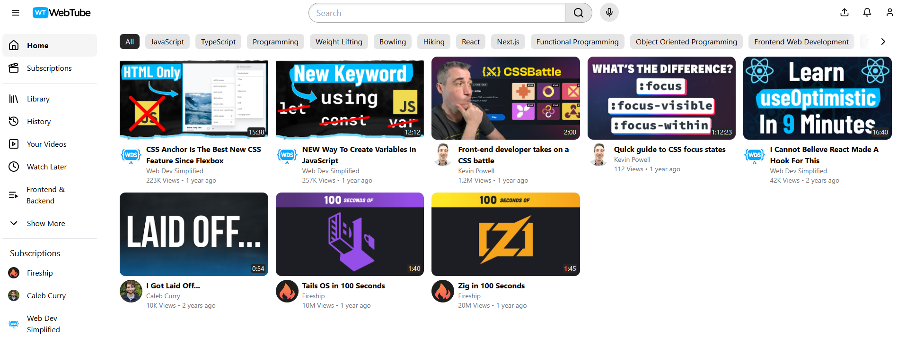

# YouTube Clone



This is a clone of the YouTube homepage, created using React. The application mimics the look and feel of YouTube's main page, providing users with a similar experience.

## Live Demo

You can view the live application at [YouTube Clone](https://youtube-clone-mauve-kappa.vercel.app/).

## Features

- **Responsive Design**: The layout adapts to different screen sizes, providing an optimal experience on both desktop and mobile devices.
- **Video Thumbnails**: Displays a grid of video thumbnails, similar to the YouTube homepage.
- **Search Functionality**: Users can search for videos (functionality can be implemented in future iterations).
- **Easy Navigation**: Simple navigation menu for easy access to different sections.

## Technologies Used

- **React**: JavaScript/Typescript library for building user interfaces.
- **TailwindCSS**: Styling the components to resemble the YouTube homepage.
- **TypeScript**: Core programming language used throughout the project.

## Installation

To run this project locally, follow these steps:

- Clone the repository:
```
  git clone https://github.com/yourusername/youtube-clone.git
```

## Usage
After starting the application, you will see a layout similar to YouTube's homepage.
Explore the various sections and enjoy the clone of the YouTube experience!
Contributing
Contributions are welcome! If you'd like to contribute to this project, please fork the repository and submit a pull request.

## License
This project is licensed under the MIT License - see the LICENSE file for details.

## Acknowledgments

- Inspired by YouTube and its user interface design.
- Thanks to the React community for providing resources and tools.
- Special thanks to [this tutorial](https://www.youtube.com/watch?v=ymGB1lqP1CM) for guiding the development process.
